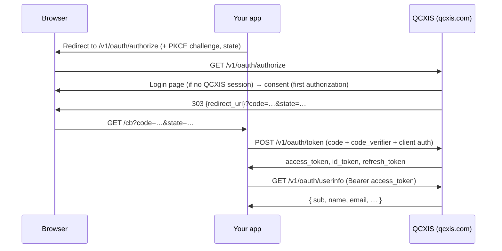

# QCXIS SSO — Developer Integration Guide

How to add **"Continue with QCXIS"** sign-in to your web or mobile app.

QCXIS is a standard **OpenID Connect (OIDC) provider** implementing **OAuth 2.1 Authorization Code + PKCE**. Any off-the-shelf OIDC client library (NextAuth/Auth.js, Laravel Socialite, Spring Security, AppAuth, flutter_appauth, oidc-client-ts, …) can integrate against it via the discovery document.

> **Audience:** developers of *relying parties* (your web app or mobile app that wants QCXIS login).
> **Provider-side design doc:** [`src/services/core-identity/SSO.md`](../src/services/core-identity/SSO.md) · **API contract:** [`src/packages/openapi/core-identity/oauth.yaml`](../src/packages/openapi/core-identity/oauth.yaml)

---

## 1. TL;DR

| | |
|---|---|
| Protocol | OpenID Connect 1.0 / OAuth 2.1 |
| Flow | Authorization Code + **PKCE (S256, mandatory — even for confidential clients)** |
| Issuer (prod) | `https://qcxis.com` |
| Discovery | `https://qcxis.com/.well-known/openid-configuration` |
| JWKS | `https://qcxis.com/.well-known/jwks.json` |
| Scopes | `openid profile email offline_access` |
| ID token | JWT, RS256 |
| Access token | **Opaque** random string (NOT a JWT — do not try to decode it) |
| Refresh token | Opaque, **rotates on every use**, sliding 365-day lifetime |
| Register your app | Console → **`/console/settings/apps`** ("SSO apps") |

Quick sanity check that the provider is up:

```bash
curl -s https://qcxis.com/.well-known/openid-configuration | jq
```

---

## 2. Register your app

### 2.1 Via the console (web apps)

1. Sign in at `https://qcxis.com` and open **Console → Settings → SSO apps** (`/console/settings/apps`).
   You must be the **owner or admin** of the organization (or hold the `settings.apps.manage` permission). Apps are owned by an organization — create one first at `/business` if you have none.
2. Click **New app** and fill in:
   - **App name** — shown to users on the consent screen.
   - **Redirect URI(s)** — one per line. Matched by **exact string comparison** (no wildcards, no trailing-slash forgiveness — `https://app.example.com/cb` ≠ `https://app.example.com/cb/`). `http://localhost:…` URIs are accepted, so you can test against production from your machine.
   - **Post-logout redirect URI(s)** — optional, needed only if you use RP-initiated logout (§8).
   - **App type**:
     - **Public** — single-page or mobile app. PKCE only, no secret (`token_endpoint_auth_method: none`).
     - **Confidential** — server-side app. Issues a `client_secret` (`token_endpoint_auth_method: client_secret_basic`).
3. **Copy the credentials from the one-time reveal sheet.** The `client_secret` is stored only as a one-way hash and is **never shown again**. If you lose it, delete the app and create a new one (this changes the `client_id`).

Console-created apps get `grant_types: ["authorization_code", "refresh_token"]` and `allowed_scopes: ["openid", "profile", "email", "offline_access"]`.

### 2.2 Via the API (needed for native/mobile apps)

The console form only accepts `http(s)://` redirect URIs. **Native apps need a custom-scheme redirect URI** (e.g. `myapp://auth/callback`), which the backend fully supports — register those directly against the API with your console bearer token:

```bash
curl -X POST https://qcxis.com/api/v1/oauth/clients \
  -H "Authorization: Bearer $YOUR_ACCESS_TOKEN" \
  -H "Content-Type: application/json" \
  -d '{
    "name": "My Mobile App",
    "redirect_uris": ["myapp://auth/callback"],
    "post_logout_redirect_uris": [],
    "grant_types": ["authorization_code", "refresh_token"],
    "allowed_scopes": ["openid", "profile", "email", "offline_access"],
    "token_endpoint_auth_method": "none"
  }'
```

The `201` response is the **only** time `client_secret` is returned (empty string for public clients).

Client management endpoints (all require a bearer from an org owner/admin, or a member holding the `settings.apps.manage` permission):

| Method | Path | Notes |
|---|---|---|
| `GET` | `/api/v1/oauth/clients?org_id=…` | List your org's apps |
| `POST` | `/api/v1/oauth/clients` | Create (secret returned once) |
| `GET` | `/api/v1/oauth/clients/{client_id}` | Read (never returns the secret) |
| `PATCH` | `/api/v1/oauth/clients/{client_id}` | Update name / URIs / scopes / grant types / auth method. **Do not use `rotate_secret`** — the new secret is not returned, which locks the client out. Delete + recreate instead. |
| `DELETE` | `/api/v1/oauth/clients/{client_id}` | Soft-delete. Any app using these credentials stops working immediately. |

> `is_first_party` cannot be set through the API (hard 403) — it is platform-operator-only.

---

## 3. Endpoints

All endpoints live on the public origin (prod `https://qcxis.com`). Use the URLs from the discovery document verbatim.

| Purpose | Endpoint |
|---|---|
| Discovery | `GET /.well-known/openid-configuration` |
| JWKS (id_token keys) | `GET /.well-known/jwks.json` |
| Authorize | `GET /v1/oauth/authorize` |
| Token | `POST /v1/oauth/token` (form-encoded only — JSON bodies are rejected) |
| UserInfo | `GET /v1/oauth/userinfo` (**GET only** — POST returns 405) |
| Revocation | `POST /v1/oauth/revoke` |
| Introspection | `POST /v1/oauth/introspect` (**first-party clients only** — see §7) |
| End session (logout) | `POST /v1/oauth/logout` |

Discovery advertises: `response_types_supported: ["code"]`, `grant_types_supported: ["authorization_code","refresh_token","client_credentials"]`, `token_endpoint_auth_methods_supported: ["client_secret_basic","none"]`, `id_token_signing_alg_values_supported: ["RS256"]`, `code_challenge_methods_supported: ["S256"]`, `scopes_supported: ["openid","profile","email","offline_access"]`.

---

## 4. Web app integration (Authorization Code + PKCE)



### 4.1 Redirect the user to authorize

Generate a PKCE pair first (any AppAuth-style library does this for you):

```js
// PKCE: verifier = 43–128 chars of URL-safe randomness; challenge = BASE64URL(SHA256(verifier))
const verifier  = base64url(crypto.randomBytes(32));
const challenge = base64url(crypto.createHash("sha256").update(verifier).digest());
```

```
GET https://qcxis.com/v1/oauth/authorize
    ?response_type=code
    &client_id=c_0190a1b2c3d4…
    &redirect_uri=https://app.example.com/cb
    &scope=openid%20profile%20email%20offline_access
    &state=<random-url-safe-string>
    &code_challenge=<challenge>
    &code_challenge_method=S256
    &nonce=<random>            (optional, recommended)
    &prompt=login              (optional — forces re-authentication)
```

Rules that differ from lenient providers:

- **`state`, `code_challenge`, and `code_challenge_method` are required.** Omitting any of them fails the request before OAuth validation even runs.
- **`code_challenge_method` must be exactly `S256`** — `plain` is rejected. PKCE applies to confidential clients too; libraries that default PKCE off (some Laravel Socialite / Passport setups) must enable it.
- **`redirect_uri` must exactly match a registered URI.**
- Every requested **scope must be in your client's `allowed_scopes`**, otherwise the whole request fails with `invalid_scope` (no silent down-scoping).
- Keep `state` **URL-safe** (e.g. base64url) — it is echoed back into the redirect without re-encoding, so `&`/`#` characters will corrupt your callback URL.
- Validation errors (bad client, bad redirect_uri, bad scope) are returned as **HTTP 400 JSON to the browser**, never to your redirect_uri. The only error you receive via redirect is `?error=access_denied` when the user declines consent.
- `prompt=login` forces re-authentication. `prompt=consent` is accepted but **has no effect** (consent re-display cannot be forced).

If the user has an active QCXIS session (a one-year sliding browser cookie), login is skipped. On the first authorization of a third-party app the user sees a **consent screen** listing your requested scopes; the grant is remembered per user+app until you request a scope the previous grant didn't cover. The consent hop must complete within **10 minutes** or the flow must be restarted.

### 4.2 Exchange the code

The code is **single-use and expires in ~60 seconds** — redeem it immediately, never retry a used code.

```bash
curl -X POST https://qcxis.com/v1/oauth/token \
  -H "Content-Type: application/x-www-form-urlencoded" \
  -u "c_0190a1b2c3d4…:$CLIENT_SECRET" \
  -d grant_type=authorization_code \
  -d code="$CODE" \
  -d redirect_uri="https://app.example.com/cb" \
  -d code_verifier="$VERIFIER"
```

- Confidential clients authenticate with **HTTP Basic** (`client_secret_basic`, shown above) or `client_id`+`client_secret` form fields (`client_secret_post`). If both are sent, the Basic header wins.
- Public clients send just `client_id` as a form field (no secret) — PKCE is the proof.
- `redirect_uri` must be **identical** to the value used at `/authorize`.

Response:

```json
{
  "access_token": "…opaque…",
  "token_type": "Bearer",
  "expires_in": 900,
  "refresh_token": "…opaque…",
  "id_token": "eyJhbGciOiJSUzI1NiIs…",
  "scope": "openid profile email offline_access"
}
```

- `expires_in` is the **access-token** TTL (default 15 min).
- `refresh_token` is only issued when you requested the **`offline_access`** scope (or your client is registered with the `refresh_token` grant type — console apps are).
- `id_token` is only issued when scopes include **`openid`**.

### 4.3 Refresh

```bash
curl -X POST https://qcxis.com/v1/oauth/token \
  -u "c_0190a1b2c3d4…:$CLIENT_SECRET" \
  -d grant_type=refresh_token \
  -d refresh_token="$REFRESH_TOKEN"
```

Critical behaviors:

- **Client authentication is required on refresh too** — confidential clients must send their secret on every refresh, public clients their `client_id`.
- **Refresh tokens rotate on every use.** Each response contains a *new* refresh token with a fresh full lifetime (sliding 365-day expiry). **Always persist the newest one.**
- **Reuse detection:** replaying an already-rotated refresh token more than ~60 s after rotation is treated as theft and **revokes every refresh token for that user+client** — the user is logged out of your app everywhere. Multi-tab/multi-process clients must single-flight refreshes (the QCXIS web app itself serializes them with the Web Locks API).
- If the original grant included `openid`, every refresh response automatically contains a fresh `id_token` — the `scope` parameter on refresh requests is ignored (no scope narrowing either; the response always echoes the originally granted scopes). Refreshed id_tokens never carry a `nonce` claim — don't require one there.
- Treat `400`/`401` from refresh as a definitive sign-out; treat `429`/`5xx` as transient and retry with backoff.

### 4.4 Browser-only SPAs (no backend) — read this

Production CORS allows only the `https://qcxis.com` origin. **A third-party SPA on another domain cannot call `/v1/oauth/token` or `/v1/oauth/userinfo` from the browser** — foreign origins never receive an `Access-Control-Allow-Origin` header, so the browser blocks the call. Worse for public clients: a form-encoded token POST is a CORS *simple request*, so it still executes server-side (burning your single-use code) even though your JS can't read the response. Do the code exchange and userinfo calls **server-side** (register a confidential client). The `/authorize` hop itself is a top-level redirect, so it is unaffected by CORS.

---

## 5. Mobile / native app integration

Native apps use the same Authorization Code + PKCE flow as a **public** client with a **custom-scheme redirect URI** (registered via the API, §2.2 — the console form won't accept it).

What happens differently for custom-scheme clients:

1. Your app opens the system browser at `GET /v1/oauth/authorize` with `redirect_uri=myapp://auth/callback`.
2. If the user isn't signed in, QCXIS shows its **hosted login page** on the same origin (instead of the SPA login used by web clients). Registration is available in-flow too.
3. After login/consent the browser is redirected to `myapp://auth/callback?code=…&state=…`, which the OS hands to your app.
4. Your app exchanges the code at `/v1/oauth/token` with `client_id` + `code_verifier` (no secret).

> Register the **exact** custom-scheme URI: it must match your OS manifest (Android intent-filter / iOS URL type) and the registered value character-for-character. Using an `https://` redirect URI in a native app routes users through the web-SPA cookie flow and can loop — use a custom scheme.

Example with `flutter_appauth`:

```dart
final result = await appAuth.authorizeAndExchangeCode(
  AuthorizationTokenRequest(
    'c_0190a1b2c3d4…',
    'myapp://auth/callback',
    // On prod, issuer mode works too. Prefer discoveryUrl when pointing at
    // the IdP via an alternate host (emulator 10.0.2.2, LAN IP, dev): the
    // discovery doc's static `issuer` field won't match that host, which
    // breaks strict-issuer (fetchFromIssuer) libraries.
    discoveryUrl: 'https://qcxis.com/.well-known/openid-configuration',
    scopes: ['openid', 'profile', 'email', 'offline_access'],
  ),
);
```

> `grant_type=password` (ROPC) exists in the token endpoint but is **server-side restricted to QCXIS first-party apps** — third-party integrations cannot use it. Authorization Code + PKCE is the only interactive flow available to you.

---

## 6. Machine-to-machine (client_credentials)

For server-to-server calls with no user involved:

```bash
curl -X POST https://qcxis.com/v1/oauth/token \
  -u "$CLIENT_ID:$CLIENT_SECRET" \
  -d grant_type=client_credentials \
  -d scope="…"        # optional; defaults to your client's full allowed_scopes
```

- Requires a **confidential** client with `client_credentials` in its `grant_types`. A client without that grant type gets `400 unauthorized_client`; a public client that has it still gets `401 invalid_client` (secretless clients can't use this grant).
- The response has **no refresh_token and no id_token**; the access token carries no user, so **`/v1/oauth/userinfo` rejects it** with 401.

---

## 7. Tokens: what they are and how to validate them

| Token | Format | Default TTL | Validate by |
|---|---|---|---|
| Access token | **Opaque** ~43-char random string | 15 min | Calling `/v1/oauth/userinfo` (401 ⇒ dead) |
| Refresh token | Opaque, rotating | 365 days sliding | Using it — `invalid_grant` ⇒ dead |
| ID token | JWT (RS256, `kid` header) | 15 min | Locally against the JWKS |
| Authorization code | Opaque, single-use | 60 s | n/a — exchange immediately |

**Access tokens are not JWTs.** Do not attempt to verify them against `jwks.json`; that key material is for **id_tokens only**.

**ID token claims:** `iss` (`https://qcxis.com`), `sub` (user UUID — use this as the stable user identifier), `aud` (your `client_id`, a plain string, not an array), `exp`, `iat`, `auth_time`, `email_verified` (always present, `false` when no verified email), and — whenever set on the account — `email`, `name`, `preferred_username`, plus `nonce` on the initial code exchange. Validate `iss`, `aud == your client_id`, `exp`, and the RS256 signature via the JWKS; check `nonce` only on the initial exchange. Caveats:

- id_token claims are **not scope-gated** (unlike userinfo) — `email`/`name` appear even for a bare `openid` request.
- `auth_time` equals token-issuance time, not the original login time — don't build `max_age` checks on it.
- The JWKS contains a single active key and is served without cache headers. Cache it and re-fetch **once** on an unknown `kid`.

**UserInfo** (`GET /v1/oauth/userinfo`, `Authorization: Bearer <access_token>`) — claims are scope-gated and omitted (not null) when absent:

| Scope held by token | Claims returned |
|---|---|
| (always) | `sub` |
| `profile` | `name`, `preferred_username` |
| `email` | `email`, `email_verified` |

**Token introspection (`/v1/oauth/introspect`) is restricted to QCXIS first-party services** — third-party clients get 403 even with valid credentials. If you are building a resource server that accepts QCXIS access tokens from other parties, that pattern isn't available to you today; verify the **id_token** for authentication and use **userinfo** as the access-token liveness check. (Internal QCXIS services: use the shared `qcxis-jwt-verifier` crate with your bootstrap `c_intro_*` client.)

**Revocation** (`POST /v1/oauth/revoke`, form fields `token` + optional `token_type_hint`; confidential clients use Basic auth, public clients pass `client_id` in the body): revokes access **and** refresh tokens you own. Always returns `200`, even if the token was unknown or belonged to another client (it silently no-ops in that case).

---

## 8. Logout

```
POST https://qcxis.com/v1/oauth/logout?id_token_hint=<id_token>&post_logout_redirect_uri=<uri>&state=<state>
```

- It is a **POST** (not GET, as some RP libraries assume) and reads parameters from the **query string**.
- Always revokes the QCXIS browser session (so the user won't be silently re-signed-in on the next `/authorize`).
- `post_logout_redirect_uri` is honored **only** when a valid `id_token_hint` is supplied, and must exactly match a registered post-logout URI. Without a hint the user lands on QCXIS's own logged-out page.
- There is **no front-channel/back-channel logout or session-sync**: QCXIS does not notify your app when the user logs out elsewhere. Manage your own session and treat a failed refresh (`400`/`401`) as the logout signal.

---

## 9. Errors and rate limits

**OAuth endpoints** return RFC 6749 JSON:

```json
{ "error": "invalid_grant", "error_description": "…" }
```

| `error` | HTTP | Typical cause |
|---|---|---|
| `invalid_client` | 401 | Unknown client_id / bad secret / public client on client_credentials |
| `invalid_request` | 400 | Missing param (`code`, `redirect_uri`, `code_verifier`, non-S256 PKCE method) |
| `invalid_grant` | 400 | Expired/consumed/unknown code, redirect_uri mismatch, failed PKCE, dead refresh token |
| `unauthorized_client` | 400 | Grant type not in your client's `grant_types` |
| `unsupported_grant_type` | 400 | Unknown `grant_type` |
| `invalid_scope` | 400 | Scope not in your `allowed_scopes` |
| `invalid_token` | 401 | Bad/expired bearer at userinfo |

Client-management endpoints (`/v1/oauth/clients*`) return **plain-text** error bodies (`401 unauthorized`, `403 forbidden`, …), not JSON.

**Rate limits** (per user / per IP at the edge):

| Endpoints | Limit |
|---|---|
| `/v1/oauth/authorize`, `/v1/oauth/token` (+ login/register) | 1 req/s, burst 5 |
| Other `/v1/oauth/*` (userinfo, revoke, logout, clients) | 5 req/s, burst 30 |
| Discovery + JWKS | 30 req/s, burst 120 |

On an edge (gateway) `429` you get a `Retry-After` header (whole seconds) and a JSON body `{"error":"rate_limited","class":"…","retry_after_ms":N}` — back off accordingly. The identity service additionally applies its own per-IP anti-abuse limiter to login/register; those `429`s are a **plain-text** body with no `Retry-After` header. A gateway circuit-breaker may also answer `503 {"error":"upstream_breaker_open","upstream":"identity"}` during incidents; retry with backoff.

---

## 10. Local & test setup

- **Test against production with localhost:** `http://localhost:<port>/cb` redirect URIs are accepted at registration, so you can run the real flow from your machine with your prod-registered app.
- **Run the whole IdP locally:** `core-identity` runs standalone (Postgres + Redis + `cargo run`; migrations and a signing key auto-provision on first boot) and ships hosted `/login`, `/register`, `/consent` pages, so the complete flow works with no QCXIS web frontend. See [`src/services/core-identity/README.md`](../src/services/core-identity/README.md). Local base URL through the dev gateway: `http://localhost:8080` for a bare `cargo run` gateway — but note the repo's `src/docker-compose.override.yml` remaps the gateway to `http://localhost:18080` for compose-based stacks.
- A scripted end-to-end PKCE flow (cookie login → authorize → code → token) lives at [`src/scripts/lib/oidc.sh`](../src/scripts/lib/oidc.sh) — useful as a reference for smoke tests.

---

## 11. Integration checklist

- [ ] Registered app at `/console/settings/apps` (or via API for custom-scheme URIs); secret stored safely — it is shown **once**.
- [ ] Redirect URIs match **exactly** (scheme, host, port, path, trailing slash).
- [ ] Sending `state` + PKCE `S256` on every authorize (they're required).
- [ ] Requesting `offline_access` if you need refresh tokens.
- [ ] Code exchanged immediately (60 s, single-use), with the identical `redirect_uri`.
- [ ] Persisting the **new** refresh token after every refresh; refreshes single-flighted.
- [ ] Client credentials sent on refresh calls too.
- [ ] Validating **id_tokens** via JWKS; treating **access tokens as opaque**.
- [ ] SPAs: code exchange happens server-side (prod CORS blocks cross-origin token calls).
- [ ] Handling `429` with `Retry-After`.
- [ ] Logout implemented as POST with `id_token_hint` if you need the post-logout redirect.

### Known limitations (as of 2026-07)

- No dynamic client registration (RFC 7591) — apps are registered via console/API by an org owner/admin.
- No secret rotation — delete + recreate the app (new `client_id`).
- No introspection for third-party clients.
- No front-/back-channel logout notifications.
- No end-user "connected apps" page — a remembered consent cannot currently be revoked by the user.
- `prompt=consent` is a no-op; only `prompt=login` is implemented.
- Custom scopes can be stored on a client but have no provider-side meaning — stick to the four standard scopes.
